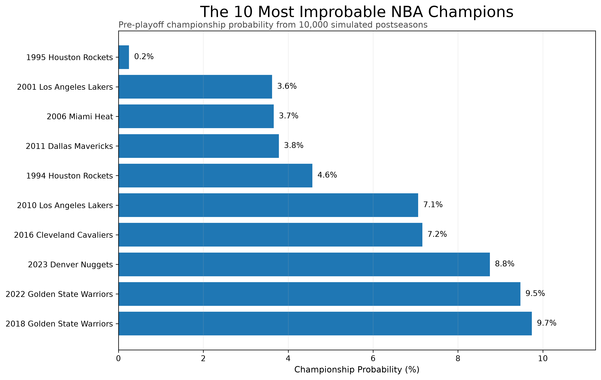
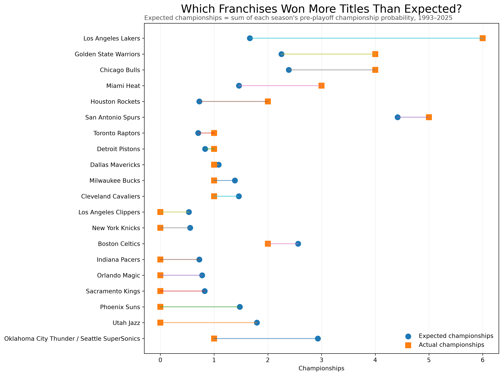

# What Was the Most Improbable NBA Championship?

I built a probability model of NBA playoff games and simulated every postseason from **1993 through 2025 10,000 times** — **330,000 simulated postseasons** — to estimate how likely each championship looked before the playoffs began.

🎥 **[Watch the full project video on YouTube](https://www.youtube.com/watch?v=ZYe--Ul4J9I)**

## The Result

The model identified the **1995 Houston Rockets** as the most improbable champion in the sample.

- **47–35 regular-season record**
- **6th seed in the Western Conference**
- **2.32 SRS**
- Won the championship in just **25 of 10,000 simulations**
- **0.25% modeled championship probability — approximately 1 in 400**

For comparison, the 2016 Cleveland Cavaliers won about **7.2%** of simulated postseasons, while the 2001 Los Angeles Lakers won about **3.6%**.



## Methodology

The project uses a game-level probability model to estimate the likelihood that the home team wins a playoff game.

The final model uses:

- **Simple Rating System (SRS)** to measure regular-season team strength
- **Home-court advantage**
- Logistic regression to convert differences in team strength into game-level win probabilities

I also tested models using offensive and defensive ratings, additional efficiency statistics, and a gradient-boosting model. On unseen playoff games, the simpler SRS-based model produced the best probability estimates.

To avoid using future information, each postseason model was trained only on the **seven postseasons immediately preceding it**. Historical playoff data begins in 1986, making **1993 the first postseason in the final analysis**.

Each historical postseason was then reconstructed and simulated **10,000 times** using the actual playoff field and series formats.

## Key Findings

### Most improbable champions

| Champion | Pre-playoff championship probability |
|---|---:|
| 1995 Houston Rockets | **0.25%** |
| 2001 Los Angeles Lakers | **3.62%** |
| 2006 Miami Heat | **3.66%** |
| 2011 Dallas Mavericks | **3.78%** |
| 1994 Houston Rockets | **4.57%** |
| 2010 Los Angeles Lakers | **7.06%** |
| 2016 Cleveland Cavaliers | **7.16%** |

### Expected vs. actual championships

Adding each franchise's pre-playoff championship probabilities across the full sample produces an estimate of **expected championships**.

Some notable results:



| Franchise | Expected | Actual | Difference |
|---|---:|---:|---:|
| Los Angeles Lakers | 1.66 | 6 | **+4.34** |
| Golden State Warriors | 2.25 | 4 | **+1.75** |
| Chicago Bulls | 2.39 | 4 | **+1.61** |
| Miami Heat | 1.46 | 3 | **+1.54** |
| Phoenix Suns | 1.48 | 0 | **-1.48** |
| Utah Jazz | 1.80 | 0 | **-1.80** |
| Seattle SuperSonics / Oklahoma City Thunder | 2.93 | 1 | **-1.93** |

These differences should not be interpreted as pure measures of luck, clutch performance, or underperformance. The model deliberately uses only information available before each postseason and cannot capture everything that changes once the playoffs begin.

## Repository Structure

```text
nba-championship-probability/
├── notebooks/
│   ├── 01_data_collection.ipynb
│   ├── 02_model_development.ipynb
│   ├── 03_playoff_simulation.ipynb
│   └── 04_results_analysis.ipynb
│
├── data/
│   ├── nba_playoff_games_1986_2025.csv
│   ├── nba_team_seasons_1986_2026.csv
│   ├── nba_playoff_model_data_1986_2025.csv
│   ├── nba_championship_probabilities_1993_2025.csv
│   ├── nba_actual_champion_probabilities_1993_2025.csv
│   └── nba_franchise_expected_vs_actual_1993_2025.csv
│
├── outputs/
│   └── charts/
│       ├── most_improbable_nba_champions.png
│       └── franchise_expected_vs_actual.png
│
├── requirements.txt
└── README.md

## How to Run

Clone the repository and install the required Python packages:

```bash
git clone https://github.com/jedcain1-cmd/nba-championship-probability.git
cd nba-championship-probability
pip install -r requirements.txt
```

Then open Jupyter and run the notebooks in order:

1. `01_data_collection.ipynb`
2. `02_model_development.ipynb`
3. `03_playoff_simulation.ipynb`
4. `04_results_analysis.ipynb`

The processed datasets used by the analysis are also included in the `data/` directory.

## Tools

Python · pandas · NumPy · scikit-learn · Matplotlib · nba_api · Jupyter
